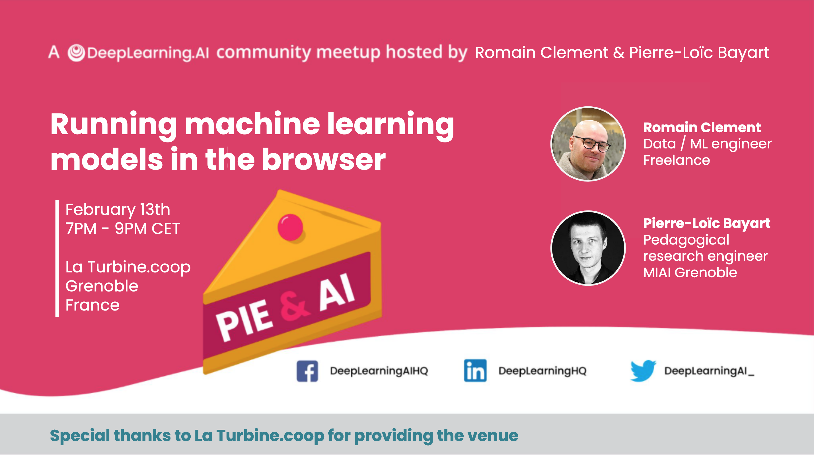

<!-- _paginate: skip -->
<!-- _footer: "" -->

<style>
section::after {
  content: attr(data-marpit-pagination) '/' attr(data-marpit-pagination-total);
}
</style>



---

# Agenda

| Time          | Event                       |
| ------------- | --------------------------- |
| 19:00 - 19:05 | Introduction from Andrew Ng |
| 19:05 - 20:00 | Talk + Q&A                  |
| 20:00 - 21:00 | Networking                  |

---

# Introduction from Andrew Ng

<iframe
    src="https://drive.google.com/file/d/1zM2cTa_NllO1_vih1rEGIMvH1J_56piR/preview"
    width="800"
    height="450"
    allow="autoplay"
></iframe>

---

# Running machine learning models in the browser

## Summary

1. 🧠 ML workflow
2. 🤝 ONNX format
3. 🌍 WebAssembly
4. ⚙️ Deploy in the browser
5. 🧑‍💻 Examples
6. 🏁 Final notes

---

## 😸 It's a cat!

What are we trying to achieve?

[Quick demo](samples/imaging/index.html)

<!-- Quick demo of image classification with a cat -->

---

## 🧠 ML workflow

Two distinct phases:

1. Model training
2. Model inference


---

## 🧠 ML workflow

> Model training

- Offline
- Data collection
- Compute intensive (CPU, GPU)
- Python, R, Julia, MATLAB, etc.


---

## 🧠 ML workflow

> Model inference

- Online runtime
- Predictions from trained model
- Less compute intensive
- Python, C++, Go, Rust, etc.

<!-- Note: while it may be less compute intensive than training, it can become power hungry when used at scale with lots of users (cf. OpenAI with ChatGPT) -->


---

## 🤝 ONNX format

[Open Neural Network Exchange][onnx]

- Generic ML model representation
- Common file format
- Training / inference loose coopling
- Interoperability
- Inference in any language
- Inference on multiple backends


<!-- Note: while the name implies NN, it can be used for any type of model not only NNs -->

<!-- Note: runtime reference implementation in C++, bindings for most languages -->

<!-- Note: backends available for CPU, CUDA, OpenVINO, proprietary HW accelerators, etc. -->

<!-- Source: https://azure.microsoft.com/fr-fr/blog/onnx-runtime-for-inferencing-machine-learning-models-now-in-preview/ -->

---

## 🤝 ONNX format

Export models from favourite framework:

- Scikit-Learn: [sklearn-onnx][sklearn-onnx]
- Tensorflow: [tensorflow-onnx][tensorflow-onnx]
- PyTorch: [torch.onnx][torch-onnx]

> ⚠️ Some models or layer types might not be supported by generic [operators][onnx-operators] yet!

---

## 🤝 ONNX format

Using [Netron][netron] to visualize an ONNX model


---

<!-- _footer: "" -->


---

## 🤝 ONNX format

Available runtimes:

* C/C++
* Python
* ...
* **Web**!

---

## 🌍 WebAssembly

[_WASM_][webassembly]

- Portable compilation target
- Client and server applications
- Major browsers support (desktop, mobile)
- Fast, safe and open
- Privacy


<!-- Note: supported by all major browsers since 2017 -->

<!-- Privacy: no personal information leaking server-side (cf. OpenAI) -->

---

## 🌍 WebAssembly

Famous usage in Data Science ecosystem:

* [Pyodide][pyodide] (_Python in browser_)
* [JupyterLite][jupyterlite] (_JupyterLab in browser_)
* [PyScript][pyscript] (_Python in HTML_)
* **ONNX Runtime Web**!

---

## ⚙️ Deploy in the browser

> Training (with Scikit-Learn)

```python
# Train model on training dataset
model.fit(X_train, y_train)

# Convert to ONNX
onnx_model = skl2onnx.to_onnx(model, X_train[:1].astype(np.float32))

# Save ONNX model to ONNX format
onnx_model_path.write_bytes(onnx_model.SerializeToString())
```

---

## ⚙️ Deploy in the browser

> Inference (with ONNX Runtime Web)

```html
<script type="module">
// import ONNXRuntime Web
import * as ort from "https://cdn.jsdelivr.net/npm/onnxruntime-web/dist/esm/ort.min.js"

// Create an inference session and load the model
const session = await ort.InferenceSession.create('./model.onnx')

// prepare inputs
const area = new ort.Tensor('float32', Float32Array.from([areaInput]), [1, 1])
const rooms = new ort.Tensor('float32', Float32Array.from([roomsInput]), [1, 1])
const latitude = new ort.Tensor('float32', Float32Array.from([latitudeInput]), [1, 1])
const longitude = new ort.Tensor('float32', Float32Array.from([longitudeInput]), [1, 1])
const inputs = { area, rooms, latitude, longitude }

// feed inputs and run
const results = await session.run(inputs)

// read from results
const outputVariable = results.variable.data
</script>
```
---

## 🧑‍💻 Examples

GitHub Repository

[`pieandai-grenoble/2024-02-23-ml-models-web`](https://github.com/pieandai-grenoble/2024-02-23-ml-models-web)

---

## 🧑‍💻 Examples

🏠 Housing Value Estimation

- [Notebook](samples/housing/training.html)
- [Web](samples/housing/index.html)

---

## 🧑‍💻 Examples

🍿 Sentiment Analysis

- [Notebook](samples/sentiment/training.html)
- [Web](samples/sentiment/index.html)

---

## 🧑‍💻 Examples

🌉 Image Classification

- [Notebook](samples/imaging/training.html)
- [Web](samples/imaging/index.html)
- [Web (live)](samples/imaging/live.html)

---

## 🏁 Final notes

✨ Pros

- Inference at the edge
- No server required for inference
- Easier app integration
- Support for WebGPU API (experimental)

☢️ Cons

- Lack of documentation
- Memory limitations
- Model size

---

# 📚 References

- [ONNX][onnx]
- [ONNX Runtime][onnx-runtime]
- [ONNX Runtime Inference Examples][onnx-runtime-web-samples]
- [Netron][netron]
- [sklearn-onnx][sklearn-onnx]
- [tensorflow-onnx][tensorflow-onnx]
- [torch.onnx][torch-onnx]
- [WebAssembly][webassembly]

---

# 🙋 Q&A

## Thank you for your attention!

## Any questions?

---

## Thank you for attending the first Pie & AI event in Grenoble, France!

> **🔥 Tip**
>
> You will receive a promo code for a 50% off first month subscription on Coursera after filling the form sent by DeepLearning.ai


<!--
We'll send out a survey to the list of registrants after the event, and we’ll offer course promo code to the people who complete the survey.

Please remind your event attendees during the event to keep an eye out for our email if they’d like to receive the code.

The code is for 50% off first month subscription for any of our courses on Coursera.
 -->

[onnx]: https://onnx.ai
[onnx-operators]: https://onnx.ai/onnx/operators/
[onnx-runtime]: https://onnxruntime.ai
[onnx-runtime-web-samples]: https://github.com/microsoft/onnxruntime-inference-examples
[netron]: https://netron.app
[sklearn-onnx]: https://onnx.ai/sklearn-onnx/
[tensorflow-onnx]: https://github.com/onnx/tensorflow-onnx
[torch-onnx]: https://pytorch.org/docs/stable/onnx.html
[webassembly]: https://webassembly.org
[pyodide]: https://pyodide.org
[jupyterlite]: https://jupyterlite.readthedocs.io
[pyscript]: https://pyscript.net